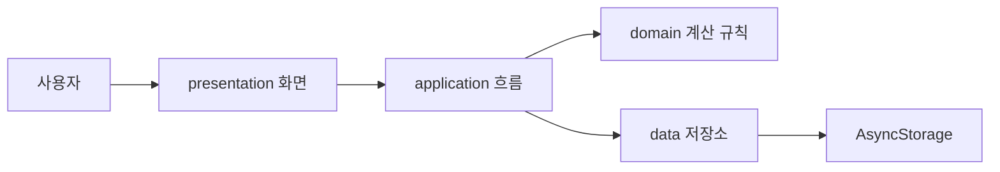

# Energy Budget

Energy Budget은 오늘의 컨디션과 남은 시간에 맞춰 할 일을 다시 정리해주는 모바일 앱입니다.  
핵심 문장은 **"더 많이 하게 만드는 앱이 아니라, 오늘의 나를 기준으로 계획을 다시 세우게 돕는 앱"**입니다.

## GitHub 주소

- Repository: https://github.com/winjjws-hash/Finbit
- GitHub Pages: https://winjjws-hash.github.io/Finbit/
- 최종 평가 PDF: https://winjjws-hash.github.io/Finbit/Energy_Budget_Final_Evaluation_Presentation.pdf
- num.slogs.dev 확인용 GitHub 주소: `https://github.com/winjjws-hash/Finbit`

## 비전 제시

Energy Budget의 비전은 사람들의 하루 계획을 **시간 중심에서 에너지 중심으로 바꾸는 것**입니다.

기존 계획 앱은 할 일을 많이 담는 데 집중하지만, 실제 생활에서는 시간이 남아도 피곤하면 계획을 지키기 어렵습니다. Energy Budget은 피로도, 기분, 남은 시간을 먼저 보고 오늘 감당 가능한 일을 추천합니다.

## 문제 정의

계획 실패는 단순한 의지 부족이 아니라 **컨디션을 고려하지 않은 과부하 설계 문제**입니다.

- 시간은 남아도 피로하면 집중력이 떨어집니다.
- 할 일이 많을수록 투두앱은 정리 도구가 아니라 부담으로 느껴질 수 있습니다.
- 사용자는 오늘 할 수 있는 일과 미뤄도 되는 일을 구분할 기준이 필요합니다.

## 활용 방안 및 기대 효과

- 과제, 공부, 프로젝트가 많은 날에 오늘 할 일을 현실적으로 조절합니다.
- 컨디션이 낮은 날에는 무리한 계획을 줄이고 미룰 일을 분리합니다.
- 날짜별 계획과 월간 달력을 통해 과제가 많은 요일을 확인합니다.
- 앞으로 SQLite 저장, 주간 리포트, 요일별 에너지 패턴 분석으로 발전시킬 수 있습니다.

## 프로젝트 계획: WBS

| 주차 | 목표 | 진행 상태 | 산출물 |
|---|---|---:|---|
| 10주차 | 비전, 문제 정의, 요구사항, MoSCoW, WBS | 100% | `.planning/00-vision.md`, `.planning/01-requirements.md`, `.planning/02-wbs.md` |
| 11주차 | ADR, 앱 구조, 개발 환경 설정 | 100% | `.planning/decisions/`, `docs/architecture.md`, `docs/setup.md` |
| 12주차 | 핵심 입력 기능 | 100% | 컨디션 입력, 할 일 추가, 날짜/마감 시간/에너지 소모 입력 |
| 13주차 | 계산과 추천 기능 | 100% | 에너지 예산 계산, 지금 할 일/미룰 일 분리 |
| 14주차 | 기록과 알림 확장 | 100% | 날짜별 저장, 월간 보기, 알림 현황 |
| 15주차 | 테스트와 최종 발표 | 100% | 발표 PDF, Q&A, README, AGENTS.md |

자세한 WBS와 일정은 `.planning/02-wbs.md`, `.planning/04-schedule.md`, `docs/Energy_Budget_WBS_Gantt.xlsx`에 정리했습니다.

## 기술 스택

| 기술 | 사용 이유 |
|---|---|
| React Native | 모바일 앱 형태의 UI 구현 |
| Expo | 빠른 개발 서버 실행, Android/Web export 검증 |
| TypeScript | 입력값과 계산 로직의 타입 오류 감소 |
| AsyncStorage | MVP 단계의 닉네임, 날짜별 계획, 알림 설정 저장 |
| Mermaid | 아키텍처 다이어그램 문서화 |
| GitHub Pages | 발표 PDF, WBS, 발표자료를 URL로 공개 |
| AI Agent / Skills / Workflow | 기획, 문서화, PDF 생성, UI 개선, 검증 자동화에 활용 |

## 앱 구조 설명

```text
src/
  presentation/  사용자가 보는 화면과 모바일 UI
  application/   화면 흐름과 use case
  domain/        EnergyTask, DailyCondition, 에너지 계산 규칙
  data/          로컬 저장소와 repository
docs/            setup/deploy/testing/architecture 문서
.planning/       비전, 요구사항, WBS, 일정, ADR
AGENTS.md        AI Agent 작업 정책 파일
```

아키텍처는 `presentation -> application -> domain -> data` 흐름으로 나누었습니다. 화면 코드와 계산 규칙을 분리해서 수정과 설명이 쉬운 구조를 목표로 했습니다.

## 아키텍처 다이어그램



## 구현 방법 설명

1. 사용자가 피로도, 기분, 남은 시간, 할 일을 입력합니다.
2. `calculateEnergyBudget`이 오늘의 에너지 예산을 계산합니다.
3. 각 할 일의 `energyCost`를 비교해 지금 하면 좋은 일과 나중으로 미룰 일을 분리합니다.
4. 날짜별 계획은 AsyncStorage에 저장합니다.
5. 마감 3시간 전과 1시간 전 알림 현황을 앱 내부에서 보여줍니다.

핵심 계산 로직은 `src/domain/rules/energyBudgetRules.ts`에 있습니다.

## 구현 시행착오 사례

- 처음에는 AI 추천, 리포트, DB 저장까지 한 번에 넣으려 했지만 WBS와 MoSCoW로 MVP 범위를 줄였습니다.
- 모바일 화면에서 카드와 글자가 너무 커서 실제 앱처럼 보이지 않았고, 여백과 글자 크기를 줄여 사용성을 개선했습니다.
- 알림 현황이 별도 카드로 떠서 화면이 길어졌기 때문에 첫 번째 카드 안으로 합쳐 앱 흐름을 단순화했습니다.

## 성능 최적화 노력

- 에너지 예산, 총 에너지 소모량, 추천 목록은 입력 상태가 바뀔 때만 다시 계산하도록 구성했습니다.
- 화면과 도메인 규칙을 분리해 불필요한 UI 수정이 계산 로직에 영향을 주지 않게 했습니다.
- 모바일 폭을 기준으로 카드 크기와 여백을 줄여 첫 화면 진입 속도와 가독성을 개선했습니다.

## 코드 품질 관리

- TypeScript 타입으로 `EnergyTask`, `DailyCondition`, `TaskPlacement`를 관리합니다.
- 핵심 계산 규칙은 `domain/rules`에 분리했습니다.
- 저장 기능은 `data/repositories`와 `data/local`로 분리했습니다.
- `npm run typecheck`로 타입 오류를 확인합니다.

## ADR 요약: 질의응답 준비

| ADR | 결정 | Q&A 답변 포인트 |
|---|---|---|
| ADR-0001 | React Native + Expo 선택 | 모바일 사용성이 중요하고 6주 MVP에 적합 |
| ADR-0002 | React 기본 상태 + domain 분리 | Redux는 MVP에 과하고 계산 규칙 분리가 더 중요 |
| ADR-0003 | 초기 로컬 저장 선택 | 현재는 AsyncStorage, SQLite는 다음 확장 |
| ADR-0004 | Energy Budget 주제 선택 | 실생활 활용성과 발표/포트폴리오 설명력이 높음 |

ADR 문서는 `.planning/decisions/`에 있습니다.

## 개발 환경 설정

```powershell
git clone https://github.com/winjjws-hash/Finbit.git
cd Finbit
npm install
npm run start
```

로컬 작업 폴더에서 바로 실행할 때는 다음 명령을 사용합니다.

```powershell
npm run web
```

자세한 설치 가이드는 `docs/setup.md`를 확인합니다.

## 빌드와 배포 과정

빌드는 소스코드를 실행 가능한 산출물로 만드는 과정이고, 배포는 그 산출물을 다른 사람이 접근할 수 있는 위치에 올리는 과정입니다.

```powershell
npm run typecheck
npm run test
npm run export:android
npm run export:web
npm run verify:release
```

- Android export: `dist-test/`
- Web export: `web-build/`
- GitHub Pages: 발표 PDF, WBS, 발표 자료 URL 공개

자세한 배포 가이드는 `docs/deploy.md`를 확인합니다.

## 테스트 결과: 단위/통합

```powershell
npm run test
npm run typecheck
```

- 단위 테스트: 에너지 예산 계산, 총 에너지 소모량, 과부하 판단, 추천/미루기 분리
- 통합 테스트: 컨디션 입력값과 할 일이 연결되어 오늘 계획이 만들어지는 흐름

테스트 설명은 `docs/testing.md`와 `docs/evaluation-checklist.md`에 정리했습니다.

## 시연 데모

30초 시연 순서:

1. 닉네임 입력
2. 피로도와 남은 시간 조절
3. 할 일 추가: 예상 시간, 예상 날짜, 마감 시간, 에너지 소모 입력
4. 자동 추천으로 지금 할 일과 미룰 일 분리
5. 월간 달력과 알림 현황 확인

임팩트 있는 데모 장면은 **"할 일을 더 넣는 앱이 아니라, 오늘 못 해도 괜찮은 일을 골라주는 앱"**이라는 점입니다.

## 문서화 5점 체크

- 기획서 및 요구사항: `.planning/00-vision.md`, `.planning/01-requirements.md`
- WBS/일정: `.planning/02-wbs.md`, `.planning/04-schedule.md`, `docs/Energy_Budget_WBS_Gantt.xlsx`
- 아키텍처/ADR: `docs/architecture.md`, `.planning/decisions/`
- setup/deploy/testing 문서: `docs/setup.md`, `docs/deploy.md`, `docs/testing.md`
- AGENTS.md 및 README: `AGENTS.md`, `README.md`

## 가산점 준비

- AI Agent / Skills / Workflow 적극 활용: `docs/agent-workflow.md`
- 본인만의 기법: `AGENTS.md`에 agent/skills/rules/commands 운영 정책 통합
- 최신 LLM Wiki 기반 암묵지 관리: `docs/llm-wiki.md`

## 발표 자료

- 최종 평가 PDF: `docs/Energy_Budget_Final_Evaluation_Presentation.pdf`
- 2분 발표 PDF: `docs/Energy_Budget_2min_Presentation.pdf`
- 5분 발표 대본: `docs/energy-budget-5min-script.md`
- 2분 발표 대본: `docs/presentation-script.md`
- GitHub Pages: https://winjjws-hash.github.io/Finbit/
