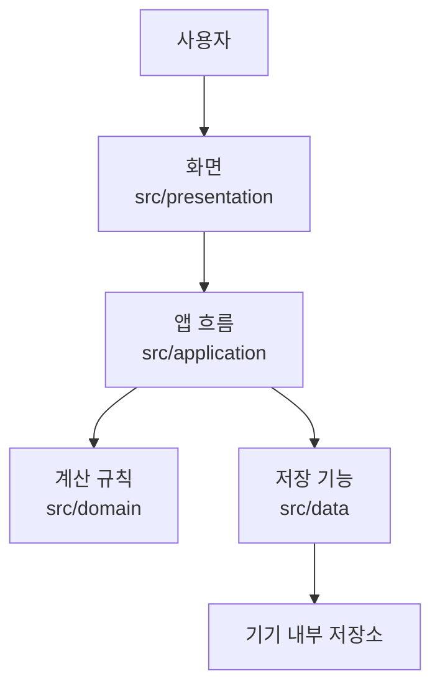
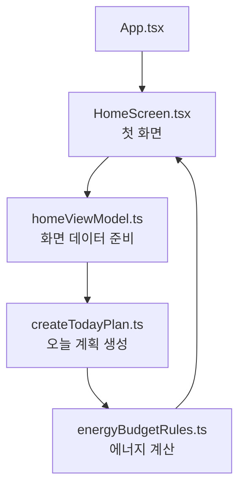

# Energy Budget - 아키텍처 설명

## 1. 한 줄 요약

Energy Budget은 화면, 앱 흐름, 계산 규칙, 저장 기능을 서로 분리해서 만든 모바일 앱이다.

쉽게 말하면 다음과 같다.

- 화면을 보여주는 코드는 `presentation`
- 화면에 필요한 데이터를 준비하는 코드는 `application`
- 에너지 예산을 계산하는 핵심 규칙은 `domain`
- 기록을 저장하고 불러오는 코드는 `data`

## 2. 왜 이렇게 나누는가

앱을 만들다 보면 화면 코드 안에 계산식, 저장 코드, 추천 로직이 전부 섞일 수 있다. 그러면 나중에 기능을 고치거나 발표할 때 구조를 설명하기 어렵다.

그래서 Energy Budget은 코드를 역할별로 나눈다. 화면은 화면만 담당하고, 계산 규칙은 계산 규칙만 담당하게 만드는 것이 목표다.

## 3. 전체 구조 그림



## 4. 폴더별 역할

| 폴더 | 쉬운 설명 | 예시 |
|---|---|---|
| `src/presentation` | 사용자가 보는 화면 | 홈 화면, 버튼, 색상 |
| `src/application` | 화면과 기능을 연결하는 중간 역할 | 오늘 계획 만들기, 화면용 데이터 정리 |
| `src/domain` | 앱의 핵심 규칙 | 에너지 예산 계산, 과부하 판단 |
| `src/data` | 데이터를 저장하고 불러오는 곳 | 오늘 계획 저장, 최근 기록 불러오기 |

## 5. 현재 디렉토리 구조

```text
src/
├── presentation/
│   ├── screens/      # 화면 파일
│   ├── widgets/      # 재사용 UI
│   └── theme/        # 색상, 간격 같은 디자인 값
├── application/
│   ├── view_models/  # 화면에 보여줄 데이터 정리
│   ├── use_cases/    # 기능 흐름
│   └── state/        # 화면 상태 관리
├── domain/
│   ├── entities/     # 앱에서 쓰는 데이터 형태
│   ├── rules/        # 에너지 계산 규칙
│   └── services/     # 여러 규칙을 묶는 서비스
└── data/
    ├── repositories/ # 저장소 사용 방법 정의
    ├── api/          # 나중에 외부 API가 생기면 둘 위치
    └── local/        # 로컬 저장 구현
```

## 6. 실제 예시: 오늘의 에너지 예산 보여주기

현재 첫 화면은 샘플 데이터를 사용해서 오늘의 에너지 예산을 보여준다.

흐름은 다음과 같다.

1. `App.tsx`가 앱을 시작한다.
2. `HomeScreen.tsx`가 첫 화면을 보여준다.
3. `homeViewModel.ts`가 화면에 필요한 값을 준비한다.
4. `createTodayPlan.ts`가 오늘 계획 데이터를 만든다.
5. `energyBudgetRules.ts`가 에너지 예산을 계산한다.
6. 계산된 결과가 다시 화면에 표시된다.



## 7. 기능별로 파일을 어디에 만들까

| 만들 기능 | 파일을 둘 위치 |
|---|---|
| 새 화면 | `src/presentation/screens` |
| 공통 버튼, 카드 | `src/presentation/widgets` |
| 색상, 간격, 글자 크기 | `src/presentation/theme` |
| 화면에 보여줄 데이터 정리 | `src/application/view_models` |
| 오늘 계획 생성 같은 기능 흐름 | `src/application/use_cases` |
| 에너지 계산식 | `src/domain/rules` |
| 컨디션, 할 일 데이터 형태 | `src/domain/entities` |
| 저장소 코드 | `src/data` |
| 나중에 추가할 API 호출 코드 | `src/data/api` |

## 8. 이 구조로 얻는 장점

1. 새 화면을 만들 때 어디에 파일을 둘지 헷갈리지 않는다.
2. 에너지 계산 규칙을 화면 코드와 분리할 수 있다.
3. 나중에 저장 방식을 바꿔도 화면 코드를 크게 고치지 않아도 된다.
4. 발표할 때 앱 구조를 역할별로 설명할 수 있다.

## 9. 발표할 때 이렇게 말하면 된다

Energy Budget은 네 개의 역할로 나누어 만들었습니다. 사용자가 보는 화면은 `presentation`, 화면에 필요한 데이터를 준비하는 부분은 `application`, 에너지 예산을 계산하는 핵심 규칙은 `domain`, 기록을 저장하고 불러오는 부분은 `data`에 두었습니다. 이렇게 나눈 이유는 화면 코드와 계산 규칙이 섞이지 않게 해서, 나중에 기능을 고치거나 설명하기 쉽게 만들기 위해서입니다.

## 10. 내가 이해했는지 확인하는 질문

- 새 화면을 추가하려면 어느 폴더에 파일을 만들어야 하는가?
- 에너지 예산 계산식은 어느 폴더에 있어야 하는가?
- 저장 기능은 어느 폴더에서 담당하는가?
- 화면 코드 안에 계산식이 길게 들어가면 왜 좋지 않은가?
- 지금 앱은 서버를 사용하는가, 로컬 저장을 사용하는가?
