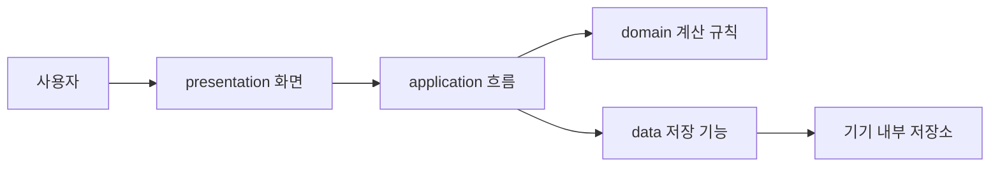

# Energy Budget 아키텍처

## 한 줄 요약

Energy Budget은 화면, 앱 흐름, 계산 규칙, 저장 기능을 서로 분리해서 만든 Expo 기반 모바일 앱이다.

## 구조를 나눈 이유

화면 코드 안에 계산식과 저장 코드가 모두 섞이면 기능을 고치기 어렵고 발표할 때 설명도 복잡해진다.

그래서 이 프로젝트는 역할을 네 부분으로 나눴다. 사용자가 보는 화면은 `presentation`, 화면과 기능을 연결하는 흐름은 `application`, 에너지 예산 계산 규칙은 `domain`, 기록 저장은 `data`가 담당한다.

## Mermaid 구조

## 폴더별 역할

| 폴더 | 역할 | 프로젝트 적용 |
|---|---|---|
| `src/presentation` | 사용자가 보는 화면 | 홈 화면, 컨디션 입력, 추천 결과 |
| `src/application` | 화면과 기능의 흐름 | 오늘 계획 생성, 화면 데이터 정리 |
| `src/domain` | 핵심 규칙 | 에너지 예산 계산, 과부하 판단 |
| `src/data` | 저장과 불러오기 | 오늘 계획 저장, 주간 기록 조회 |

## 발표용 설명

Energy Budget은 네 개의 역할로 나누어 만들었습니다. 사용자가 보는 화면은 `presentation`, 화면에 필요한 흐름은 `application`, 에너지 예산을 계산하는 핵심 규칙은 `domain`, 기록 저장은 `data`에 두었습니다. 이렇게 나누면 화면 코드와 계산 규칙이 섞이지 않아서 나중에 기능을 고치거나 발표에서 구조를 설명하기 쉽습니다.
